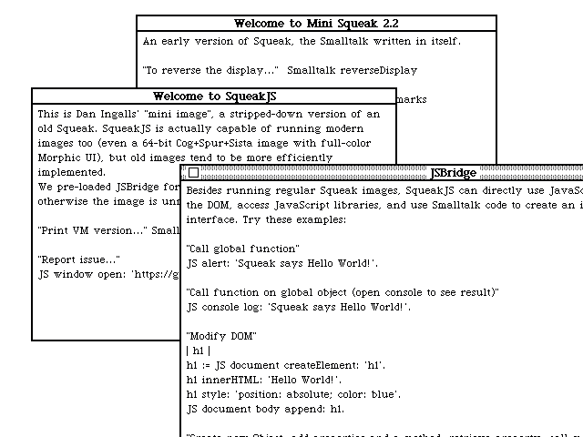

# SqueakG — a Go port of SqueakJS

A port of the [SqueakJS](https://squeak.js.org/) Smalltalk virtual machine (in
the parent directory) to Go, with a native [Ebitengine](https://ebitengine.org/)
display.

**It boots.** The Go VM loads the classic `demo/mini.image`, runs the bytecode
interpreter with primitives and a BitBlt, and renders the Mini Squeak 2.2 MVC
desktop — windows, title bars, and StrikeFont text — headless to a PNG:



## Status

| Layer | JS source | Go | State |
|---|---|---|---|
| Constants / layouts | `vm.js` | `internal/vm/constants.go` | ✅ done |
| Object model (classic) | `vm.object.js` | `internal/vm/object.go` | ✅ done |
| Image loader (classic 6502) | `vm.image.js` | `internal/vm/image.go` | ✅ done & verified |
| Bytecode interpreter (V3) | `vm.interpreter.js` | `internal/vm/interp*.go` | ✅ boots mini.image |
| Primitives (core set) | `vm.primitives.js` | `internal/vm/primitives*.go` | ✅ enough to boot |
| BitBlt (pixel-based) | `plugins/BitBltPlugin.js` | `internal/vm/bitblt.go` | ✅ 1-bit MVC works |
| Display → PNG renderer | `vm.display.browser.js` | `internal/vm/render.go` | ✅ depths 1/2/4/8/16/32 |
| Ebitengine window (live) | `vm.display.browser.js` | `internal/display/`, `cmd/squeak/vmbackend.go` | ✅ interactive |
| Mouse / keyboard (MVC Sensor) | `vm.input.browser.js` | `internal/vm/input.go` | ✅ polling model |
| Do-it / print-it (Compiler) | — | `internal/vm/eval.go` | ✅ `-eval` / `-doit` |
| `become:` (identity swap) | `vm.image.js` | `internal/vm/image.go` | ✅ prims 72/128/248/249 |
| Image save (snapshot) | `vm.image.js` | `internal/vm/snapshot.go` | ✅ prim 97, writes classic format |
| Spur / 64-bit / Sista | `vm.object.spur.js` | — | ⛔ classic 32-bit only |
| JIT, FFI, sockets, sound | `jit.js`, plugins | — | ⛔ not ported |

The live window drives the VM one UI cycle per frame: it runs the interpreter
until the image polls the Sensor (`primitiveMouseButtons`, the MVC frame/idle
boundary), reads the `Display` form to RGBA, and feeds mouse/keyboard back in
using Squeak's button/modifier encoding.

## Build & run

Requires Go 1.24+. There are two commands: `cmd/squeak` is **headless** (no GUI
dependency — safe for CI/servers) and `cmd/squeakgui` is the **live window**
(links Ebitengine; cgo needed on macOS/Linux only).

Run mini.image live in an interactive window (mouse + keyboard):

```bash
make run              # or: make run-fullscreen
# equivalently: go run ./cmd/squeakgui ../demo/mini.image
```

Other classic images boot too, e.g. the 1996 **Squeak 1.1** (the earliest
public Squeak, a near-direct conversion of the Apple Smalltalk-80 v2 image):

```bash
make run IMAGE=images/Squeak1.1.image
```

It renders in 8-bit color. (These old Mac-derived images need the Mac path
delimiter `:` from `primitiveDirectoryDelimitor`, or their startup halts in
`FileDirectory>>activeDirectoryClass`.)

The window sizes the Squeak display to the host screen before boot (the image
sizes its Display to it on start-up via `primitiveScreenSize` — no manual
"restore display" needed).

**Bigger UI / fonts:** the mini image only ships 12px and 15px fonts, so use
the `-scale` factor instead — it runs the desktop at monitor-size/scale and
magnifies it with crisp nearest-neighbor pixels. `make run` defaults to
`SCALE=2` (double-size); `make run SCALE=1` is native full resolution.

```bash
make run SCALE=2               # 2x-magnified UI (default)
go run ./cmd/squeakgui -scale 2 ../demo/mini.image
```

Window keyboard shortcuts: **Cmd/Alt-D** = "do it", **Cmd/Alt-P** = "print it"
(on the current selection). They're injected as the editor's keystrokes in
`internal/display/input.go` (`doItChar` / `printItChar`).

Do-it / print-it — evaluate a Smalltalk expression headlessly:

```bash
go run ./cmd/squeak -eval "3 + 4" ../demo/mini.image             # => 7
go run ./cmd/squeak -eval "'hello' asUppercase" ../demo/mini.image  # => 'HELLO'
go run ./cmd/squeak -eval "100 factorial" ../demo/mini.image
go run ./cmd/squeak -doit "Smalltalk at: #Foo put: 42" ../demo/mini.image
# simple expressions also via: make eval EXPR='3 + 4'
```

Boot mini.image and save the screen as a PNG (headless, no cgo):

```bash
go run ./cmd/squeak -boot 0 -snap desktop.png ../demo/mini.image
```

Set `SQUEAKG_VERBOSE=1` to log one-time diagnostics (missing primitives, etc.).

Load and print diagnostics only (no run):

```bash
cd go
go run ./cmd/squeak ../demo/mini.image
```

Boot with a backtrace + primitive histogram (debugging):

```bash
cd go
go run ./cmd/squeak -boot 0 -profile ../demo/mini.image
```

Run the tests (includes a boot-and-render regression test):

```bash
cd go
go test ./...
```

## The cgo situation (important)

The goal was a native Go GUI with **no cgo**. Reality on desktop:

- **Ebitengine needs cgo on macOS and Linux**; only **Windows** is cgo-free
  (its README says so explicitly, and the macOS backend compiles Objective-C
  through cgo). Fyne and Gio have the same macOS constraint.
- A real native window on macOS *must* call Cocoa — via cgo, or via hand-rolled
  `purego` calls. Truly zero-cgo-everywhere would mean a browser-canvas or
  terminal display instead of a native window.

We chose **Ebitengine, accepting cgo on macOS/Linux** for a real native window.
Ebitengine is the right fit because Squeak's display is just a framebuffer:
BitBlt renders one bitmap, and the shell blits that RGBA buffer to the window
and feeds mouse/keyboard events back — exactly Ebitengine's model.

Build for Windows with no cgo:

```bash
CGO_ENABLED=0 GOOS=windows GOARCH=amd64 go build ./cmd/squeak
```

## Architecture

```
cmd/squeak         CLI entry point (diagnostics today; boots the VM later)
internal/vm        the virtual machine
  constants.go     header codes, special-object indices, class layouts
  object.go        Object struct + format decoding + class/method/context accessors
  image.go         classic image reader (header, oopMap, install, fixups)
  interp.go        Interpreter state + init path (bytecode loop is the TODO)
  diagnostics.go   human-readable image summary
internal/display   Ebitengine window/input shell
  shell.go         Backend interface + ebiten.Game adapter
  input.go         mouse/keyboard polling -> Backend
  demo.go          placeholder backend until the VM produces frames
```

A Smalltalk value is modeled as Go `any`, holding either an `int`
(a SmallInteger) or an `*Object` — mirroring SqueakJS, where SmallIntegers are
plain numbers and everything else is an object.

The VM will drive the window by implementing `display.Backend`: `Frame()`
returns the Squeak Display form as RGBA, `Step()` runs the VM for a frame, and
`Mouse`/`Key` push input events into the VM's event queue.

## Roadmap (next steps)

1. **Bytecode interpreter loop** — port `vm.interpreter.js`: `interpret`,
   `fetchNextBytecode`, sends, returns, closures, context switching.
2. **Core primitives** — port `vm.primitives.js`: arithmetic, `at:`/`at:put:`,
   object allocation, `perform:`, process/semaphore, time.
3. **BitBlt** — port `BitBltPlugin.js` so the Display form gets pixels.
4. **Wire the real display Backend** — replace the demo backend with one that
   reads the Squeak Display form and forwards the event queue.
5. **Spur + 64-bit image format** — port `vm.object.spur.js` and the Spur branch
   of the loader to run modern images (`headless.image`, Cuis, etc.).
6. Later: image saving, more plugins (Sockets, FFI, sound), optional JIT.
```
